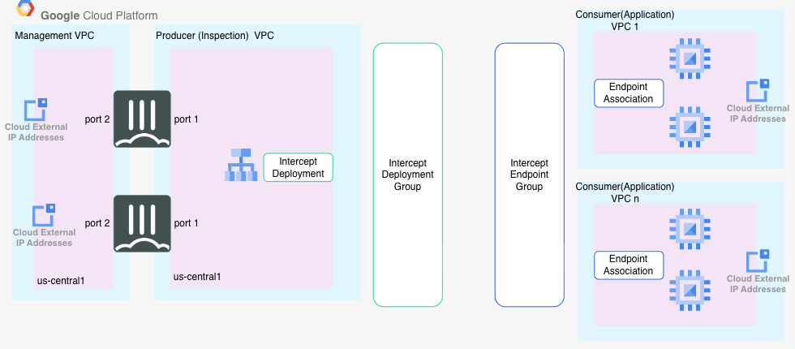

# FortiGate NSI (Network Security Integration) Terraform Configuration

**Experimental**
 
This Terraform configuration deploys a FortiGate Network Service Insertion (NSI) infrastructure on Google Cloud Platform, based on the gcloud configurations provided. The deployment creates the necessary VPC networks, subnets, FortiGate instances in a Managed Instance Group, load balancer components, and NSI-specific resources required for traffic inspection.

```mermaid
flowchart LR
    %% FortiGate NSI on GCP. One FortiGate, unmanaged instance group, forwarding
    %% rule and intercept deployment is created per zone in var.zones; two zones
    %% are shown. Names assume the default prefix "fgt-nsi".

    subgraph CONSUMER["Consumer side · workload VPCs"]
        direction TB
        subgraph DEMO["Demo workload · deploy_web_servers = true"]
            direction TB
            WEB["Web VPC · 10.12.0.0/24<br/>Debian 12 web servers<br/>Apache · iperf3"]
            WEB2["Web2 VPC · 10.13.0.0/24<br/>Debian 12 web servers<br/>Apache · iperf3"]
            WEB <-->|VPC peering| WEB2
        end
        OWN["Your VPCs<br/>CONSUMER_NETWORKS"]
    end

    subgraph NSI["NSI · created by setup-nsi.sh"]
        direction TB
        FWP["Global network firewall policy<br/>newfgt-nsi<br/>rule 10 ingress · rule 11 egress<br/>0.0.0.0/0 → apply profile group"]
        SPG["Security profile group (org)<br/>&lt;project&gt;-ftnt-spg1<br/>+ custom intercept profile -sp1"]
        EPG["Intercept endpoint group<br/>newfgt-nsi-ftnt-epg"]
        DG["Intercept deployment group<br/>newfgt-nsi-ftnt-dg"]
        DEP["Intercept deployments<br/>fgt-nsi-&lt;zone&gt; · one per zone"]
        FWP --> SPG --> EPG --> DG --> DEP
    end

    subgraph PRODUCER["Producer side · Inspection VPC · 10.50.160.0/24"]
        direction TB
        subgraph LB["Internal passthrough load balancer"]
            direction TB
            FR["Forwarding rules<br/>fgt-&lt;zone&gt; · UDP 6081<br/>reserved IP per zone"]
            BES["Backend service (UDP)<br/>session affinity CLIENT_IP<br/>health check TCP 8080"]
            FR --> BES
        end
        subgraph ZA["Zone A"]
            FGT_A["FortiGate-VM<br/>unmanaged instance group"]
        end
        subgraph ZB["Zone B"]
            FGT_B["FortiGate-VM<br/>unmanaged instance group"]
        end
        NAT["Cloud NAT"]
        BES --> FGT_A
        BES --> FGT_B
    end

    subgraph MGMT["Management VPC · 10.50.180.0/24"]
        MGMT_NET["port2 · external IP per FortiGate"]
    end

    ADMIN(["Admin"])
    FORTICARE(["FortiCare / FortiGuard<br/>FortiFlex licensing"])

    %% Associations made per VPC by setup-nsi.sh
    FWP -. "policy association" .-> CONSUMER
    EPG -. "endpoint group association" .-> CONSUMER
    DEP -->|references| FR

    %% Intercepted traffic
    CONSUMER ==>|"intercepted traffic<br/>Geneve UDP 6081"| FR

    %% Management and egress
    ADMIN -->|"HTTPS 8443 · SSH 22"| MGMT_NET
    MGMT_NET --- FGT_A
    MGMT_NET --- FGT_B
    FGT_A -.-> NAT
    FGT_B -.-> NAT
    NAT -.-> FORTICARE

    %% Styling
    classDef ext fill:#f3e5f5,stroke:#7b1fa2
    classDef fgt fill:#ffecb3,stroke:#ef6c00
    classDef lb fill:#c8e6c9,stroke:#2e7d32
    classDef nsi fill:#ffcdd2,stroke:#c62828
    classDef workload fill:#e1f5fe,stroke:#0277bd
    classDef net fill:#b3e5fc,stroke:#0277bd

    class ADMIN,FORTICARE ext
    class FGT_A,FGT_B fgt
    class FR,BES,NAT lb
    class FWP,SPG,EPG,DG,DEP nsi
    class WEB,WEB2,OWN workload
    class MGMT_NET net
```




<sub>Diagram source: [architecture-diagram.mmd](architecture-diagram.mmd)</sub>


## Architecture Overview



This deployment creates:

### VPC Networks
- **Inspection VPC** (`fgt-nsi-ib-new`): Data/traffic inspection network (10.50.160.0/24)
- **Management VPC** (`fgt-nsi-ib-new-mgmt`): FortiGate management network (10.50.180.0/24)  
- **Web VPC** (`fgt-nsi-ib-new-web`): Public web network (10.12.0.0/24)

### FortiGate Infrastructure
- **Instance Template**: FortiGate VM template with dual network interfaces
- **Managed Instance Group**: Auto-scaling group with 3 FortiGate instances across multiple zones
- **Health Checks**: HTTP health checks for load balancer backend service
- **Load Balancer**: Internal UDP load balancer for Geneve traffic (port 6081)
- **Forwarding Rules**: Three zone-specific forwarding rules for NSI deployment

### NSI (Network Security Inspection) Components
- **Intercept Deployment Group**: Global deployment group for FortiGate NSI
- **Intercept Deployments**: Zone-specific intercept deployments linking forwarding rules
- **Intercept Endpoint Group**: Endpoint group for traffic interception
- **Intercept Endpoint Group Association**: Associations with the web VPCs and any `CONSUMER_NETWORKS`
- **Security Profiles**: Custom intercept security profile for traffic processing
- **Security Profile Group**: Group containing the custom intercept profile
- **Firewall Policy**: Network firewall policy with NSI rules for ingress/egress traffic
- **Firewall Policy Association**: Policy associations with the web VPCs and any `CONSUMER_NETWORKS`

### Test Infrastructure (optional)
- **Web Server VMs**: Debian 12 instances across three zones for testing NSI functionality, preloaded with Apache and iperf3
- **Web / Web2 VPCs**: Two peered workload VPCs hosting the web servers

All of the test infrastructure is controlled by `deploy_web_servers` (default `true`). Set it to `false` to deploy only the FortiGate NSI producer side. `setup-nsi.sh` then skips the web VPC associations. List your own workload VPCs in `CONSUMER_NETWORKS` instead (see [Inspecting your own VPCs](#inspecting-your-own-vpcs-consumer_networks)).

### Security
- **Firewall Rules**: Allow all ingress/egress traffic on all VPCs plus health check rules
- **Network Interfaces**: Dual-interface setup (inspection + management)
- **Service Account**: Cloud Platform scope for GCP API access

## Prerequisites

1. **GCP Project**: Active GCP project with billing enabled
2. **APIs Enabled**: 
   - Compute Engine API
   - Cloud Resource Manager API
3. **Permissions**: IAM permissions for creating compute resources
4. **Terraform**: Version >= 1.0.0

## Quick Start

### 1. Clone and Setup
```bash
git clone <your-repo-url>
cd gcp-nsi
```

### 2. Configure Variables
```bash
cp terraform.tfvars.example terraform.tfvars
```

Edit `terraform.tfvars` with your specific values:
```hcl
project_id      = "your-gcp-project-id"
organization_id = "your-gcp-organization-id"
region          = "us-central1"
prefix          = "fgt-nsi"
admin_password = "YourSecurePasswordHere!"
```

### 3. Initialize and Deploy
```bash
terraform init
terraform plan
terraform apply
```

### 4. Access FortiGates
After deployment, FortiGate instances will have public IP addresses for management access:
- URL: `https://<fortigate-ip>:8443`
- Username: `admin`
- Password: As specified in `admin_password` variable

## Configuration Variables

### Required Variables
- `project_id`: Your GCP project ID
- `region`: GCP region for deployment (default: us-central1)
- `admin_password`: FortiGate admin password

### Optional Variables
- `fortigate_machine_type`: VM machine type (default: c4-standard-4)
- `fortigate_instance_count`: Number of FortiGate instances (default: 3)
- `zones`: Availability zones for instance distribution
- `prefix`: Resource naming prefix (default: fgt-nsi)
- `admin_port`: FortiGate admin port (default: 8443)
- `deploy_web_servers`: Deploy the demo web/web2 VPCs, peering, firewall rules and web server VMs (default: true)

### Network Customization
- `inspection_subnet_cidr`: Inspection subnet CIDR (default: 10.50.160.0/24)
- `management_subnet_cidr`: Management subnet CIDR (default: 10.50.180.0/24)
- `web_subnet_cidr`: Web subnet CIDR (default: 10.12.0.0/24)

## NSI Integration

After `terraform apply`, run `setup-nsi.sh` to create the NSI resources (deployment group, per-zone deployments, endpoint group, security profile and profile group, and the `newfgt-nsi` firewall policy) and associate them with the workload VPCs:

```bash
PROJECT_ID=your-project-id ORGANIZATION_ID=123456789012 ./setup-nsi.sh
```

The demo web VPCs are associated automatically when `deploy_web_servers = true`.

### Inspecting your own VPCs (`CONSUMER_NETWORKS`)

Set `CONSUMER_NETWORKS` to a comma- or space-separated list of VPC names in `PROJECT_ID` to associate them with NSI as well:

```bash
CONSUMER_NETWORKS="prod-vpc,staging-vpc" PROJECT_ID=... ORGANIZATION_ID=... ./setup-nsi.sh
```

For each network the script creates:
- an endpoint group association named `newfgt-nsi-epga-<network>`
- a firewall policy association named `newfgt-nsi-fpa-<network>`

Names longer than 63 characters are truncated and given a hash suffix.

What to know before you add a VPC:
- **All traffic is inspected.** Rules 10 and 11 apply to all traffic (`0.0.0.0/0`) in and out of every associated VPC, and steer it through the FortiGates.
- **A VPC can have only one global network firewall policy.** If one of your VPCs already has a policy, its association fails and the script exits non-zero.
- **Typos fail early.** Every network is checked before anything is created. The script rejects unknown names and the FortiGate inspection and management VPCs. The demo web VPCs are already associated, so listing them only produces a warning.
- **Re-runs are safe.** Associations that already exist are skipped, so you can re-run with a longer list to add networks.

## File Structure

```
gcp-nsi/
├── main.tf                 # Provider configuration and locals
├── variables.tf            # Input variables
├── outputs.tf              # Output values
├── networks.tf             # VPC networks and subnets
├── firewall.tf             # Firewall rules
├── instance_template.tf    # FortiGate instance template
├── instance_group.tf       # Managed instance group
├── health_check.tf         # Load balancer health checks
├── backend_service.tf      # Load balancer backend service
├── forwarding_rules.tf     # Internal load balancer forwarding rules
├── templates/
│   └── fortigate-config.tpl # FortiGate configuration template
├── terraform.tfvars.example # Example variables file
└── README.md               # This file
```

## Outputs

The configuration provides detailed outputs including:
- VPC and subnet details
- FortiGate instance group information
- Load balancer components
- Forwarding rule IP addresses
- NSI deployment instructions

## Production Considerations

### Security
- **Firewall Rules**: The default configuration allows all traffic. Customize firewall rules for production environments based on your security requirements.
- **Admin Password**: Use a strong password and consider using Google Secret Manager.
- **Network Access**: Restrict management network access to specific IP ranges.

### Monitoring
- Enable GCP monitoring and logging for FortiGate instances
- Set up alerting for health check failures
- Monitor traffic flows and inspection statistics

### High Availability
- Instances are distributed across multiple zones automatically
- Auto-healing is enabled with health check monitoring
- Consider backup and disaster recovery procedures

### Licensing
- This configuration uses BYOL FortiGate images from `fortigcp-project-001`
- Ensure you have valid FortiGate licenses for your instances
- Update the image source in `main.tf` if using different licensing model

## Troubleshooting

### Common Issues

**Instance Template Creation Fails**
- Verify FortiGate image access permissions
- Check machine type availability in your region

**Health Checks Failing**
- Ensure FortiGate probe response is configured correctly
- Verify port 8080 is accessible on FortiGate instances

**Load Balancer Issues**
- Check that Geneve traffic (UDP 6081) is properly configured
- Verify backend service health

### Support Resources
- [FortiGate on GCP Documentation](https://docs.fortinet.com/document/fortigate-public-cloud)
- [GCP Network Service Insertion](https://cloud.google.com/vpc/docs/network-service-insertion)
- [Terraform Google Provider](https://registry.terraform.io/providers/hashicorp/google/latest/docs)

## Cleanup

Remove the NSI resources first, then destroy the Terraform resources:
```bash
CONSUMER_NETWORKS="prod-vpc,staging-vpc" PROJECT_ID=... ORGANIZATION_ID=... ./cleanup-nsi.sh
terraform destroy
```

Run `cleanup-nsi.sh` with the same `CONSUMER_NETWORKS` you passed to `setup-nsi.sh`. Leave it unset if you didn't use it.

Before deleting anything, the script checks the `newfgt-nsi` firewall policy and the endpoint group for associations it doesn't know about. These can be a network you left out of `CONSUMER_NETWORKS`, or an association someone made by hand. If it finds any, it lists them and exits without deleting anything.

**Warning**: This will permanently delete all created resources. Ensure you have backups of any important configurations or data.